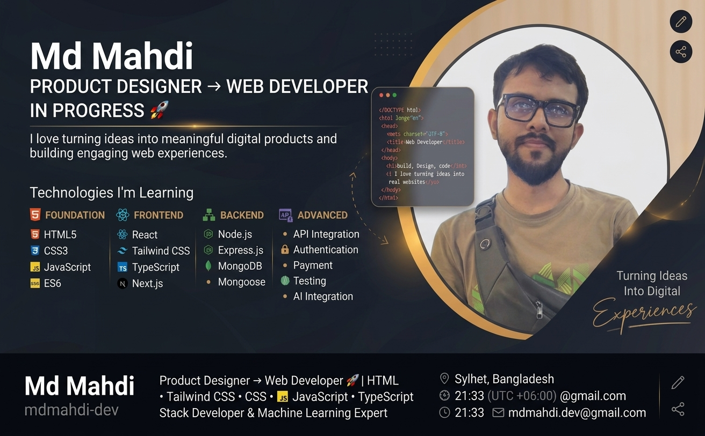

<!-- ======================= BANNER ======================= -->

<p align="center">
  
</p>

<!-- ======================= INTRO ======================= -->

<h1 align="center">Hi 👋, I'm Mahdi</h1>

<h3 align="center">
  Product Designer → Web Developer in Progress 🚀
</h3>

<p align="center">
  I love turning ideas into meaningful digital products and building engaging web experiences.
</p>

---

## 👨‍💻 About Me

* 🎨 Product Designer with a passion for technology
* 💻 Currently learning **Web Development**
* 🧠 Interested in **Problem Solving & Software Engineering**
* 🚀 Building projects and improving my skills every day
* 📚 Currently pursuing my **Master's degree at MC College**
* 🎯 Future Goal: Become a **Full-Stack Software Developer**
* 🤖 Long-term Goal: Become a **Machine Learning Expert**

---

## 🛠️ Technologies I'm Learning

### Frontend

<p>
  
</p>

### Tools

<p>
  
</p>

---

## 📈 My Learning Journey

```text
Product Design
      ↓
HTML & CSS
      ↓
Tailwind CSS
      ↓
JavaScript
      ↓
ES6 & Problem Solving
      ↓
TypeScript
      ↓
React
      ↓
Full-Stack Development
      ↓
Machine Learning 🤖
```

---

## 🚀 Live Projects

### 🧩 Dev Stack Builder

A responsive React application for exploring technologies and building your personal development stack.

**Tech Stack:** React • TypeScript • Tailwind CSS • Vite

🔗 **[Live Demo](https://dev-stack-two-flame.vercel.app/)**
📁 **[Source Code](https://github.com/mdmahdi-dev/dev-stack)**


### 🏋️ FitLog

A responsive workout library and planning application built with Next.js. Browse workouts, view detailed exercise information, create a daily workout plan, save workouts for later, and track completed exercises.

**Tech Stack:** Next.js • React • TypeScript • Tailwind CSS • REST API • LocalStorage

🔗 **[Live Demo](https://fit-log-rho-six.vercel.app/)**
📁 **[Source Code](https://github.com/mdmahdi-dev/fit-log)**

---

## 📚 Currently Learning

* ⚛️ React
* 🔷 TypeScript
* 🎨 Tailwind CSS
* 🌐 APIs & JSON
* 🔄 CRUD Operations
* 🧩 Problem Solving
* 🚀 Next.js

---

## 🎯 2026 Goals

* [ ] Become confident with React
* [ ] Build real-world web applications
* [ ] Learn Next.js
* [ ] Strengthen TypeScript skills
* [ ] Improve problem-solving skills
* [ ] Build full-stack projects
* [ ] Deploy more projects
* [ ] Become a professional Full-Stack Developer

---

## 📊 GitHub Stats

<p align="center">
  
</p>

<p align="center">
  
</p>

---

## 🤝 Connect With Me

<p align="left">
  <a href="https://github.com/mdmahdi-dev">
    
  </a>
</p>

---

<p align="center">
  <i>🚀 Learning. Building. Improving. One project at a time.</i>
</p>
